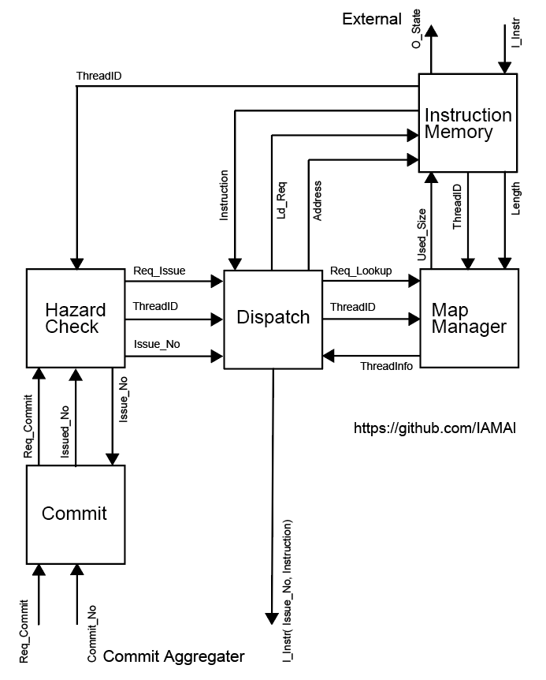

## MPUモジュール

MPUモジュールは外部からの実行指示やスレッドプログラムを管理し、実際プログラムを実行するTPUへのプログラムの供給やデータのやり取りを行い、外部と実行ユニットの間に位置します。
図はMPUの主なモジュールを示しています。
命令メモリ（スレッドメモリ）、マップ管理ユニット、ハザード検出器、ディスパッチ（発行器）、コミットユニットが主なモジュールです。

命令メモリ（スレッドメモリ）は外部から受け取ったスレッドプログラムを保持します。
外部からのスレッドの実行リクエストに従い、ハザード検出器でスレッド間の依存関係について問題がなければそのスレッドをディスパッチユニットが発行しスレッドメモリからプログラムを読み出してTPUへ送信します。
スレッドメモリへのアクセスの際にメモリ内どの位置にどの長さ（サイズ）でアクセスすればよいかをマップ管理ユニットが管理しています。
スレッドプログラムのスレッドメモリへのストアした際にメモリ上その先頭位置と長さをマップ管理ユニットへスレッドIDと共にに送信しマップ管理ユニットは記録します。
ハザードが解決したいちばん古いスレッド実行リクエストはハザード検出器からディスパッチユニットへそのスレッド番号が送信されディスパッチユニットはスレッドのプログラムをスレッドメモリから読み出すためにマップ管理ユニットへスレッドIDとともに問い合わせて、開始アドレスと長さの情報を得ます。

  

