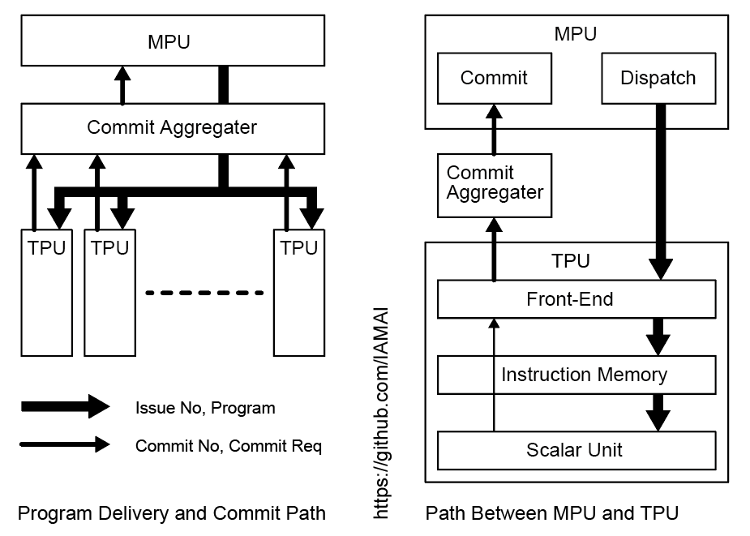
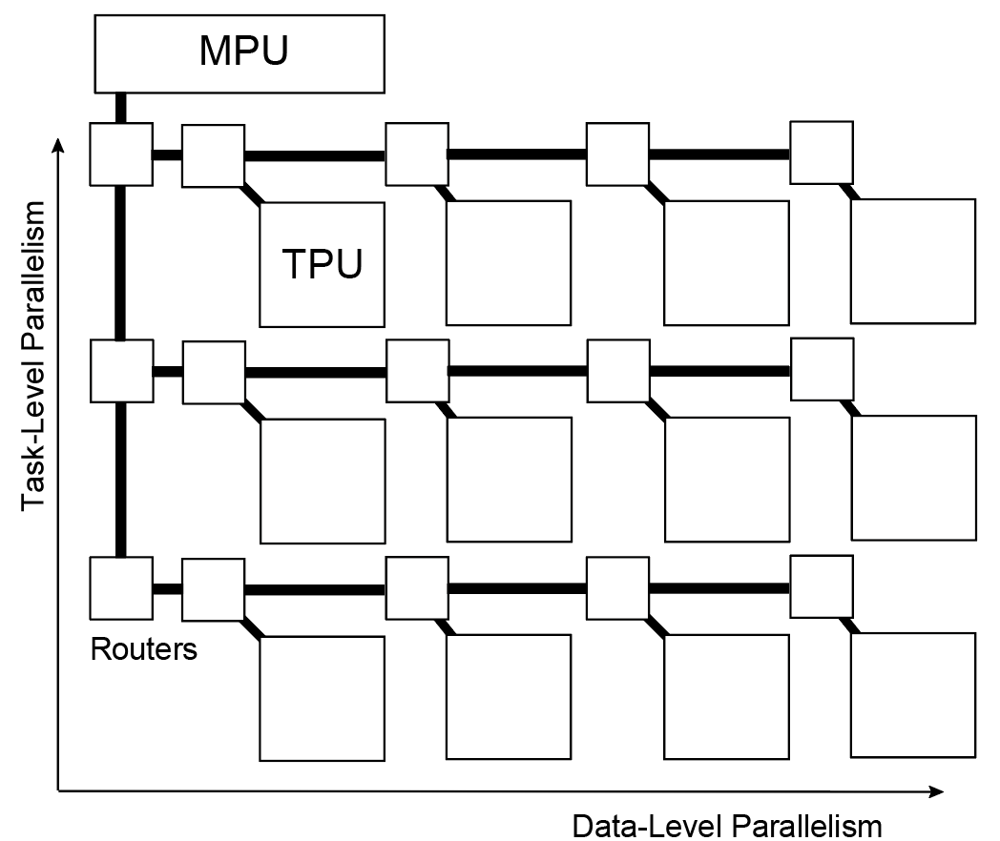

## MPU-TPU間の経路

#### プログラムとコミット

MPUは外部から受け取ったスレッドプログラムを一つ以上のTPUに渡し、また実行を終えたことをTPUから通知を受け次のスレッドプログラムをTPUへ渡す必要があります。
図はこのために用意されている経路とそれに付属するモジュールを示しています。

左図は全体を俯瞰した図です。
MPUはスレッドを発行した際のその発行番号とスレッドプログラムを送信します。
TPUは受け取ったプログラムを実行して終了したことをMPUへ通知しますが、複数のTPUから同時に通知を受け取り、処理を行う事は効率が悪いのでコミット集約器と呼ぶモジュールでいったんコミット通知を受け取ります。
複数のTPUについて同じスレッドプログラムを実行した場合、それらすべての実行終了をした時に他のスレッドプログラムより先に発行されていればMPUへこのコミット集約器は通知します。
従ってこのコミット集約器は従来のプロセッサにおけるコミットと同じ役割を持つと言えます。

  

右の図は同様にMPUとTPUの間の経路を示していますが任意のTPU内でどのように扱われるかを示しています。
MPUから受け取ったスレッドプログラムはフロントエンドが管理を行い、命令メモリ（バッファ）へストアされスカラユニットの実行終了（或いはアイドリング状態）の時にフロントエンドはスカラユニットへこのプログラムの実行を指示します。
スカラユニットは命令メモリから一般的なプロセッサと同様に順次命令をフェッチして命令を実行します。
スカラユニットはプログラム終了命令を検出した時その命令のコミットの後にフロントエンドは終了の通知を受けてスレッドの発行番号とともにコミット通知をコミット集約器へ送信します。

#### データ

  

上の図はデータについてMPUとTPUの間の経路について表している模式図です。
MPUとTPUの間は簡易なルータを介して接続しています。
TPUの水平方向はデータレベル並列性、垂直方向はタスクレベル並列性に相当しています。
水平方向に同じタスクが展開されることを想定しているので、MPUから下方向に経路が伸びて描く水平方向に分岐して各行のTPUへ繋がっています。
MPUとTPU間はMPUからTPUへの方向とTPUからMPUへの方向のリンクががあります。
現在個の経路はMPUの管理下にあるとしてTPUから自発的に通信をすることは想定していません。