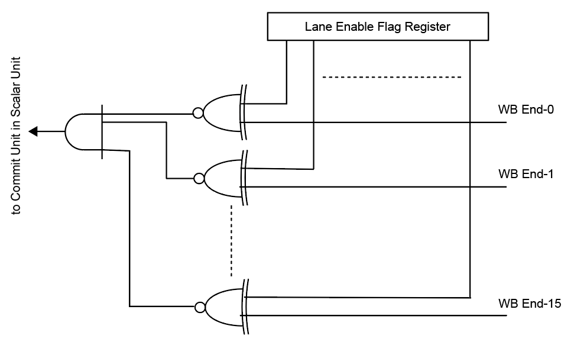

# TPU Commit Aggregation Note

個々のベクトルレーンユニットはそれぞれのタイミングで命令実行を終える場合があります。
例えばメモリアクセスの場合、データメモリ側の調停などで遅延が発生することが想定されます。
従ってばらばらのタイミングの命令実行終了信号（コミット信号）全てがそろってからスカラユニット内のコミットユニットでその命令のリタイアを処理する必要があります。

下の図はそのコミットを行うための方法を示しています。
各レーンはそのレーンを使用するかしないかを示すフラグを持ちそれがレーン使用許可フラグレジスタを形成します。
フラグ値が１の時そのフラグに対応したレーンを使用します。
このレジスタは現在の設計ではスカラユニットにあるとしています。
ベクトルレーンユニットのライトバックが終了したことを指す信号（例：WB_End-1）とフラグレジスタの値とでXNOR演算を行いすべてについて論理積を行うことで使用していないレーンも踏まえてベクトルユニットとしてのコミット信号を生成します。

  

このアイデアはTPUとMPUの間にあるコミット集約器でも踏襲されています。