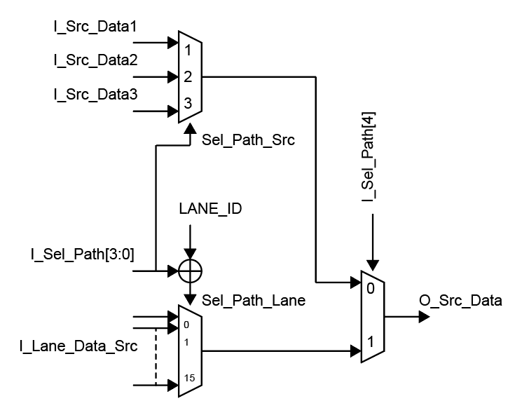

## Network Unit Note

TPUはネットワークパイプラインステージを持ちます。
ネットワークユニットはそのために用意された回路で主にベクトルユニット内のレーン間でのデータ通信を担います。
各レーンはネットワークユニットを持ちデータ通信用のネットワークを共有しています。
レジスタファイルから読み出したデータをそのネットワークへ送信し、かつネットワークから適宜データを受信してパイプラインレジスタでキャプチャしたうえで次のクロックでそのレーンの実行ユニットへ送信します。

  

各レーンは同じ命令に従いますが、ネットワークから受信する際の選択番号が異なります。
これは例えば各レーンが左側の一つ隔てたレーンから受信する場合に有効です。
また、レーンを横断したこのネットワークは論理空間上では両端は接続されていてベクトルユニットとしてみるとローテート演算相当です。
これによりデータ依存性距離を考慮したモジュロスケジューリングを実現し、配列要素の適切な書き込み先を選択できるようにします。

また、レーンを複数使用した行列演算や畳み込み演算を行う場合、レジスタから読み出したデータの再利用目的でのデータのレーン間の共有や演算結果データのレーン間での受け渡しも実現します。
これによりSIMDの一次元空間での多次元シストリックアレイ演算を可能とし、多次元シストリックアレイと同等の演算性能を有することができます。
従って多次元演算器を用意する必要がなく、その演算回路が有休になることを避け演算リソースの使用率を上げることができます。