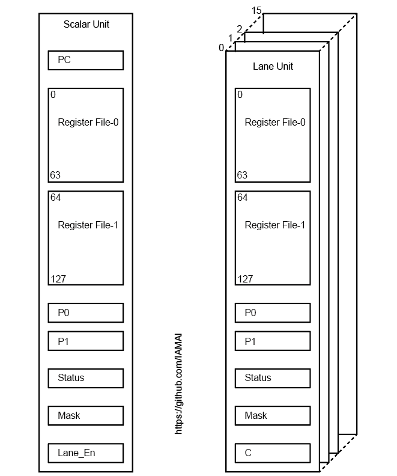

# TPU Register Map Note

下の図はTPUのレジスタマップを示します。
レジスタのセットはスカラユニットとベクトルユニットで大別できます。
ベクトルニットはレーン数の分マップを持ちます。
スカラとベクトルレーンのレジスタマップ上共通部分はレジスタファイルCレジスタ、そして状態レジスタです。
レジスタファイルは二つに分割されています。
各レジスタは2リードポート1ライトポートの構成です。
スライシングを用いる場合は二つのうちどちらか一方に適用され複数のレジスタファイルを横断するような読み書きはできません。

  

状態レジスタ（Statusレジスタ）は比較結果や演算時の状態を保持します。
スカラユニットでは分岐命令により状態レジスタを参照して分岐条件とともに評価を行いPC値を更新します。
ベクトルレーンでは比較命令により状態レジスタを参照しながらスライシング時にマスクレジスタへ順次書き込んでいきます。
分岐命令でそのマスクレジスタ内容の評価方法を決めます。
マスクを利用した命令実行を指示する命令の発行後、以降の命令はそのマスクレジスタの値に従って個々の命令を実行するかしないかを決めます。
そしてマスクを利用しない命令実行を指示する命令発行と共に以降の命令はマスクデータを条件とせず通常の実行を行います。

スカラユニットはマスクレジスタではなくベクトルユニット内の全てのレーンの使用許可を制御するレジスタLane_Enレジスタを持っています。
このレジスタの各ビットは各レーンと一対一に対応していて、フラグをセットすることで対応するレーンでのパイプライン動作を制御します。
これにより実行に不要なレーンの動作を停止させることができます。
例えばこれはリダクション演算でツリー構成のデータフローを実現する際に使用します。

スカラユニットが制御フローを決めますがコール及びリターン命令はありません。
これはソフトウェアを実行するのではなく数値演算を行うカーネルの一つのスレッドを実行することを前提としているからです。