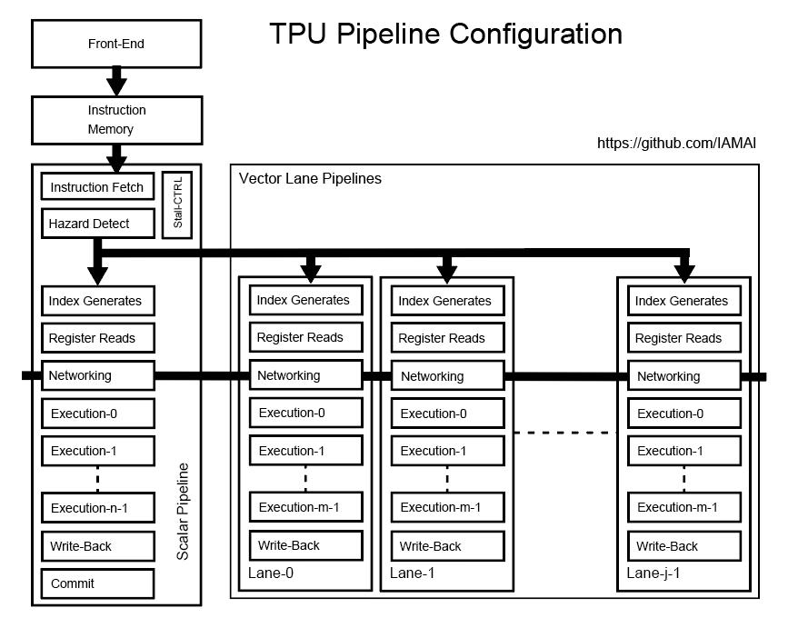

# TPU Pipeline Configuration Note

下の図はTPUのパイプライン構成を示しています。
演算器といった具体的な回路は反映していません。
MPUからTPUのフロントエンドは命令や発行番号などを受け取りインストラクションメモリに書き込みます。
また、フロントエンドはプログラムの終了時にMPUへ実行したプログラムの持つ発行番号とともにコミット信号を送信します。
このコミット信号は列方法のTPUで集められてリオーダバッファ（列バッファ）で管理され順次行リオーダバッファへ送信されます。
行リオーダバッファは各行から発行番号とコミット信号を受信して順次MPUへ送信します。

スカラユニットは命令を命令メモリからフェッチして次のクロックサイクルでハザード検知パイプラインステージへ転送します。
ハザード検知ステージではすでに発行済みの命令とこの入力された命令との間のデータハザードを評価します。
ハザードがなければその時の発行番号とともに発行されます。

スライシングを利用する場合少なくとも命令フェッチとハザード検知ステージをストールする必要があります。
このためのストール制御を行う回路を用意しています。
またデータメモリアクセス時にデータメモリから応答がない場合にもストールさせる必要があります。

  

