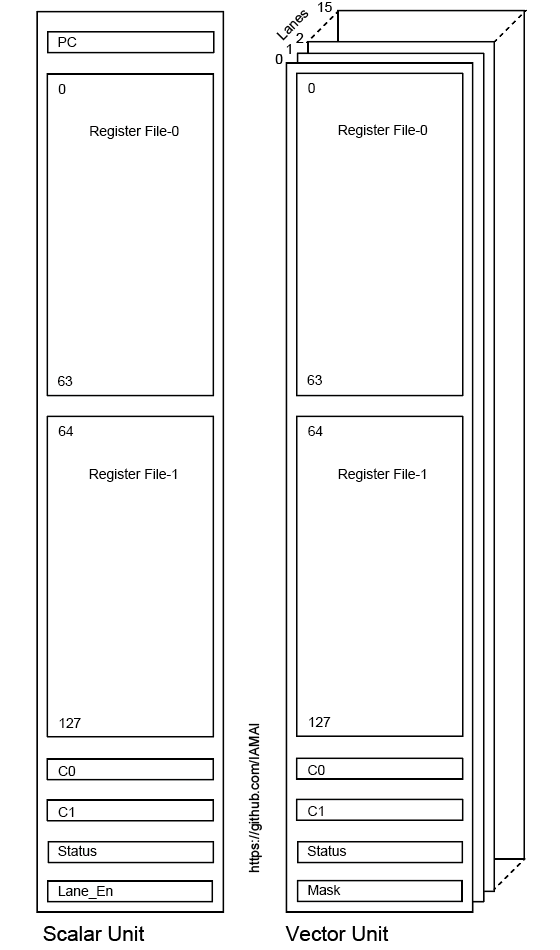

# TPU Register Map Note

下の図はTPUのレジスタマップを示します。
レジスタのセットはスカラユニットとベクトルユニットで大別できます。
ベクトルニットはレーンの数マップを持ちます。
スカラとベクトルレーンのレジスタマップ上共通部分はレジスタファイル、Cレジスタ、そして状態レジスタです。
レジスタファイルは二つに分割されています。
各レジスタは２リードポート１ライトポートの構成です。
スライシングを用いる場合は二つのうちどちらか一方に適用され複数のレジスタファイルを横断するような読み書きはできません。

状態レジスタ（Statusレジスタ）は比較結果や演算時の状態を保持します。
スカラユニットでは分岐命令により状態レジスタを参照して分岐条件とともに評価を行いPC値を更新します。
ベクトルレーンでは比較命令により状態レジスタを参照しながらスライシング時にマスクレジスタへ順次書き込んでいきます。
分岐命令でそのマスクレジスタ内容の評価方法を決めます。
以降の命令はそのマスクレジスタの値に従って個々の命令を実行するかしないかを決めます。

スカラユニットが制御フローを決めますがコール及びリターン命令はありません。
これはソフトウェアを実行するのではなく数値演算を行うカーネルの一つのスレッドを実行することを前提としているからです。

  

